## GUIA D'INSTAL·LACIÓ - NGINX AMB MÚLTIPLES SITES

1. INSTAL·LACIÓ NGINIX (Imatge 1.png, 2.png, 3.png)

* sudo apt install nginx -y

* sudo systemctl status nginx (comprovar que està actiu)

Comprovar des del client: http://IP_SERVIDOR:

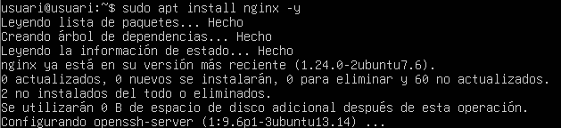
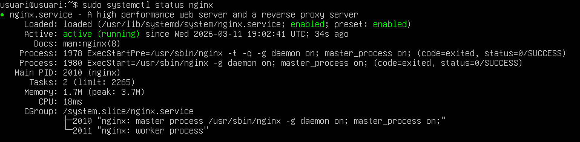
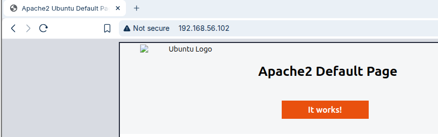

## 2. PREPARACIÓ CARPETES 

* ls -la /var/www/ (veure estrucrura existent)

* Carpeta projectenexus.test i academia.test ja creades 

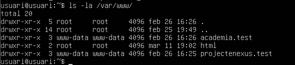

## 3. CONFIGURACIÓ SERVER BLOCKS (Imatges 5.png, 6.png)
Crear fitxer projectenexus.test, per tal de crear-los hem de posar el text que es veu a l´imatge.
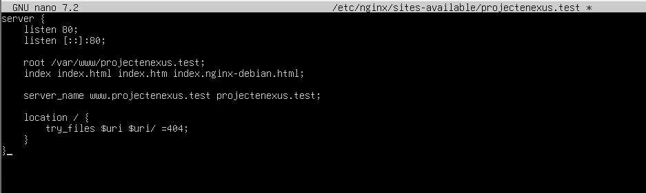

Al mateix farem amb academia.test:
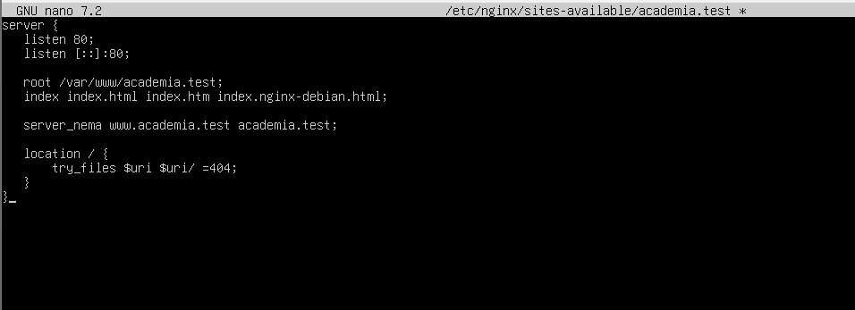

## 4. ACTIVAR ELS SITES

Aixo ho farem de la seguent manera:
* sudo ln -s /etc/nginx/sites-available/projectenexus.test /etc/nginx/sites-enabled/

* sudo ln -s /etc/nginx/sites-available/academia.test /etc/nginx/sites-enabled/

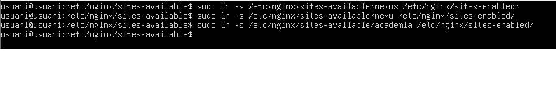
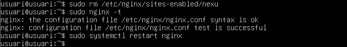

## 5. CONFIGURACIÓ CLIENT

Hem d´editar els hosts del client tal i com es veu a l´imatge:

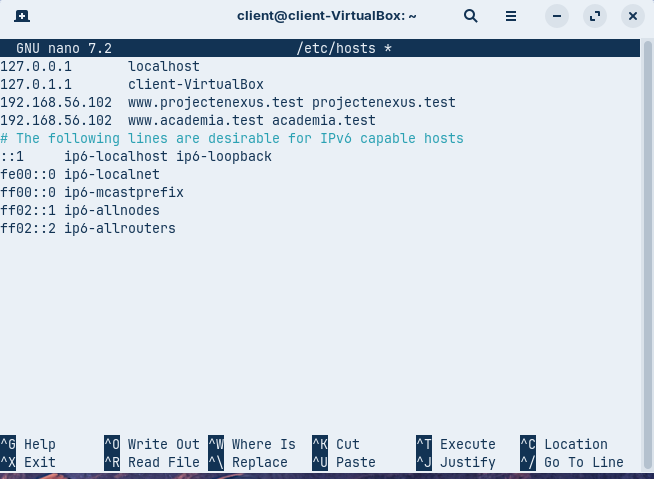

## 6. PROVA INICIAL 

Ara farem la prova tal i com es pot veure a l´imatge:

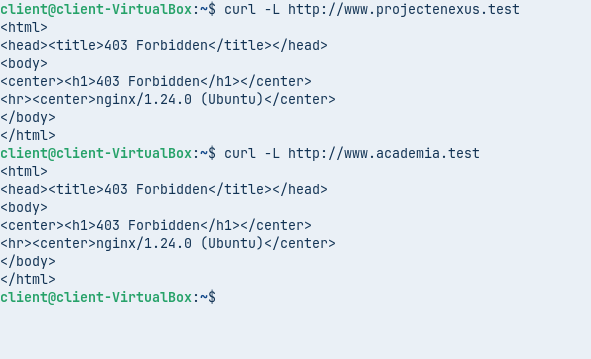

## 7. CORREGIR PERMISOS 

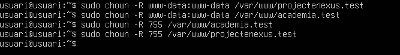

## 8. PERSONALITZAR ERROR 404

Crearem la pagina, modificarem configuracions i farem les comprovacions.
A les imatges es pot veure el procés complet.

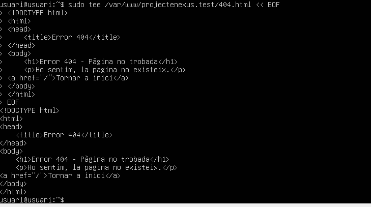
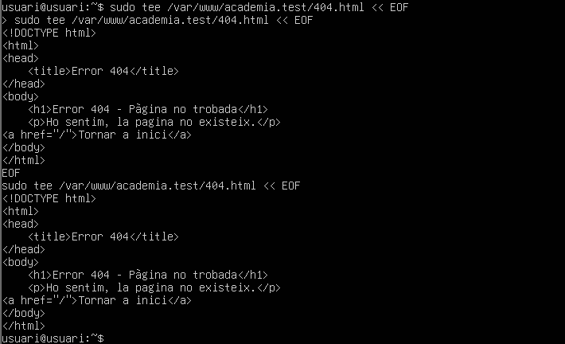
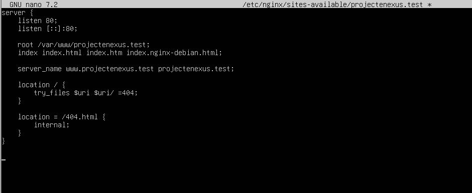
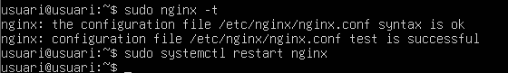
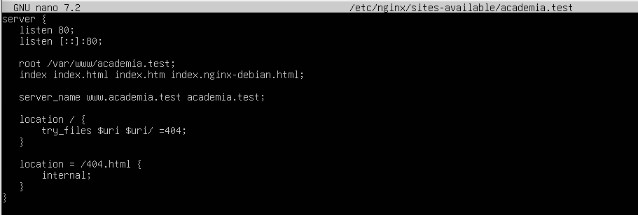
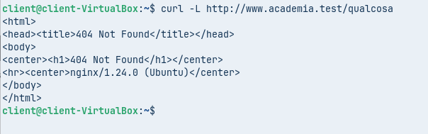

## 9. HTTPS - CREAR CERTIFICATS

Ara crearem els certficats, primer haurem de crear les carpetes, i després generarem els certficats.

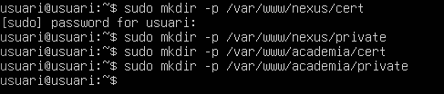
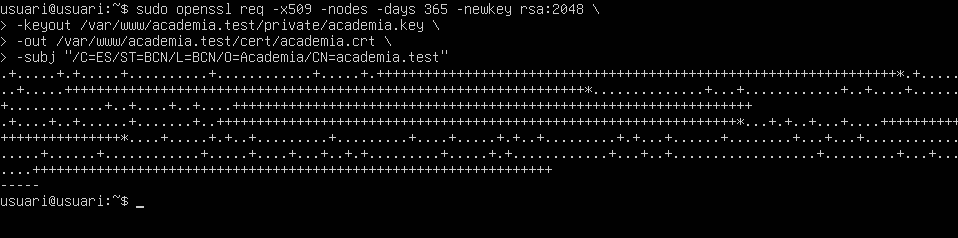

## 10. HTTPS - CONFIGURAR SERVER BLOCKS SSL

Crear fitxer per projectenexus.test SSL 

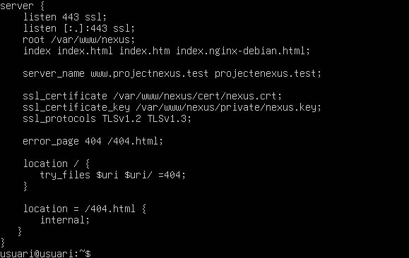
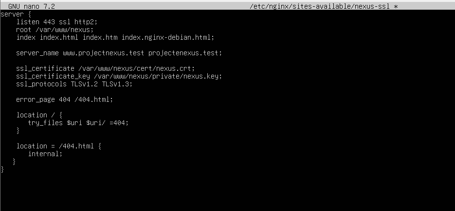

## 11. COMPROVACIONS FINALS 

Tal i com podem veure a les imatges funciona l´ultima comprovació.

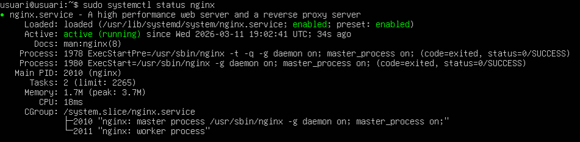
