## T06: Projecte Nexus. Implantació de PKI i Signatura Digital Corporativa

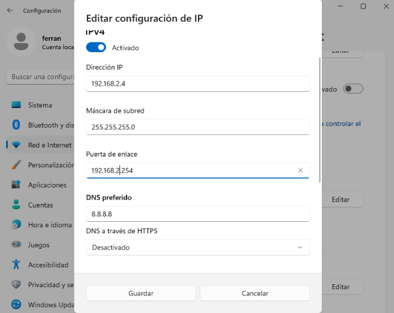

Entrem a la maquina del client i activem a IPV4 i posem la nostre ip 

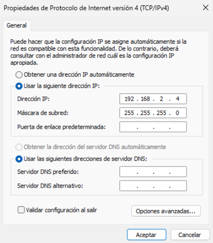

Obrim configuració anem a network & internet, entrem a ethernet - edit ip assigment seleccionem manual i activem al IPV4 i posem la ip la mascara la porta d’enllaç i el DNS.

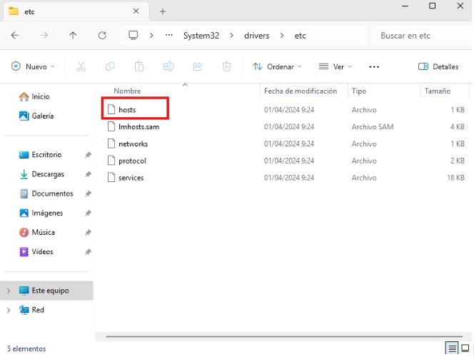

Obrim C:\Windows\System32\drivers\etc\hosts

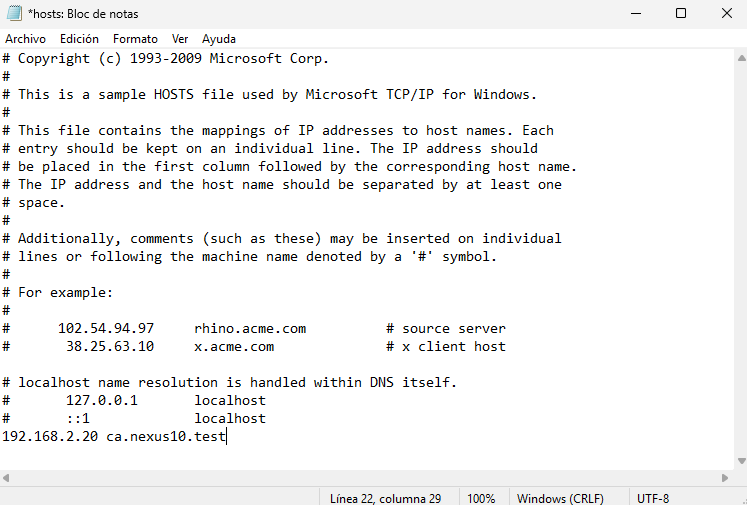

I quan obrim el hosts abaix de tot afegim la ip del servidor ubuntu que ha fet al meu company amb la seva ip.

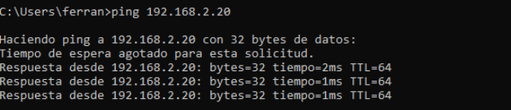

I com podem veure ja ens podem veure amb el servidor. 

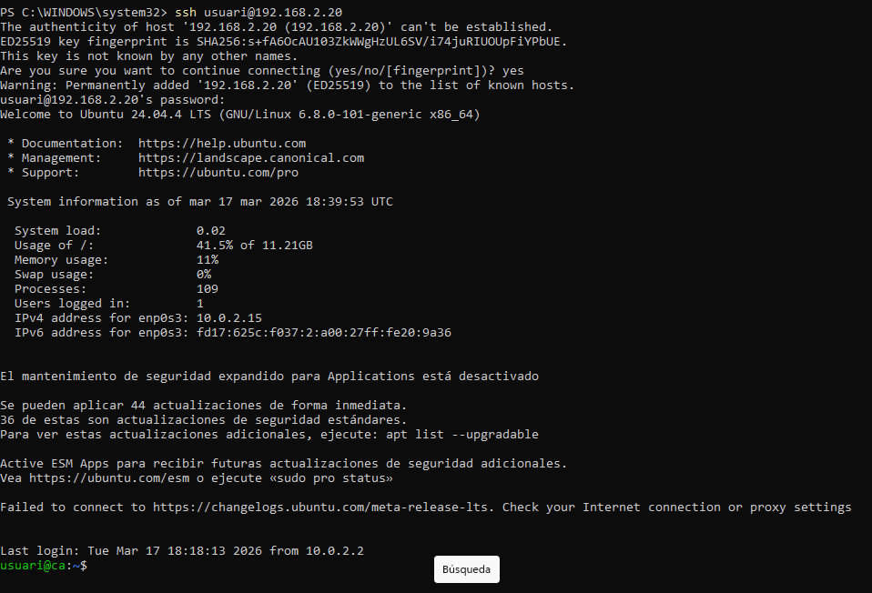

Entrem a la terminal i posem ssh usuari@192.168.2.20 que es la ip del servidor posem yes i ja estarem conectats ssh desde el servidor. 

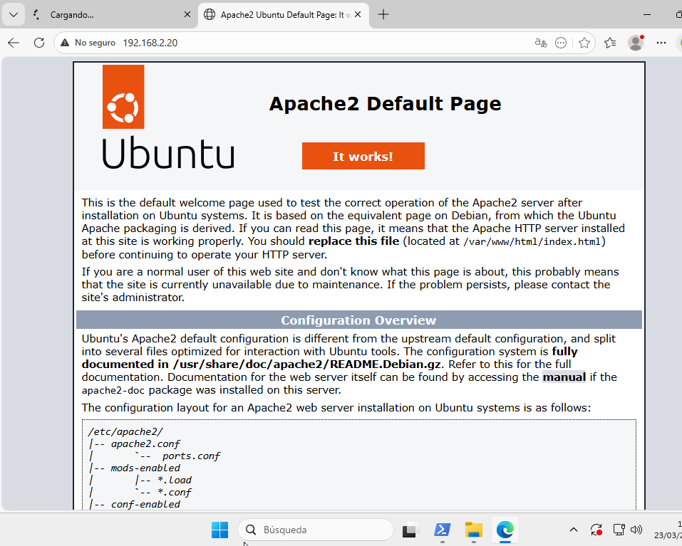

Entrem al navegador i ens connectem al apache2 del servidor posan a al navegador la seva ip que en el cas del servidor es 192.168.2.20.

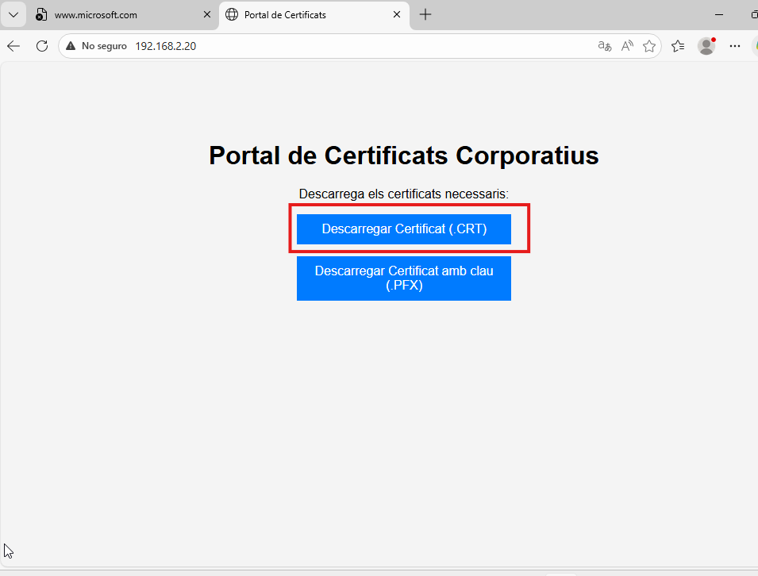

Ara a la hora que en al servidor fem el certificat si reinciem la pàgina podem veure els certificats que podem descarrega, descarreguem al CRT i al PFX. 

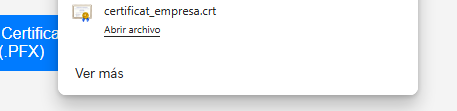

I podem veure com s’ens descarrega el certificat crt

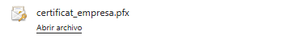

I podem veure com s’ens ha descarregat el certificat pfx. 

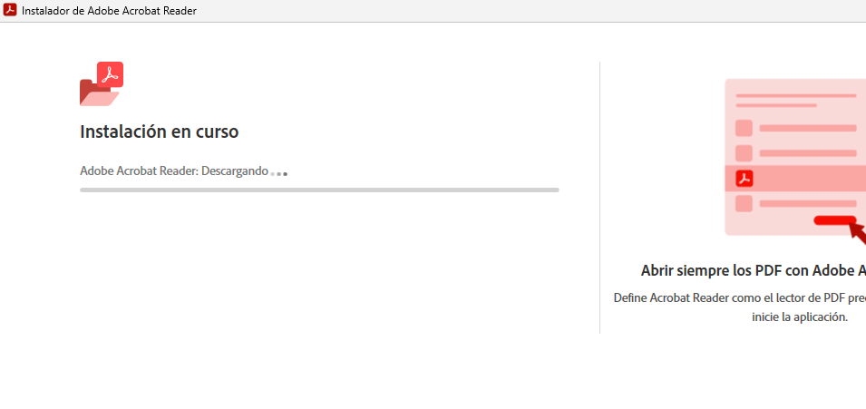

Anem al navegador i ens instal·lem al acrobat reader. 

Fem windows + R i posem certmgr.msc i aceptar.

Ens entrà en aquesta pàgina busquem certificados en los que no se puede… fem click dret i li donem a importar. 

li donem a examinar i posem al format crt i la nostre ruta.

Posem la segona opcio li donem a examinar i posem la opcio de entidades de certificación raíz de confianza.

Ja tenim la importació feta correctament. 

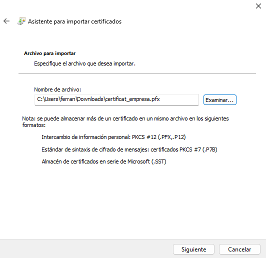

Ara obrim al certificat pfx i li donem a examinar i posem el certificat pfx. 

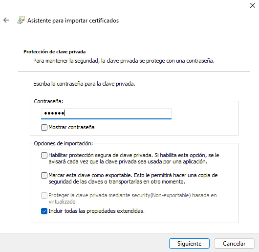

Posem la contrasenya que ha posat al servidor en al meu cas es usuari. 

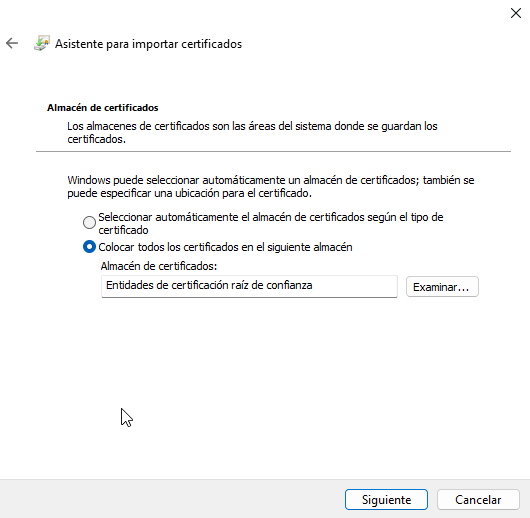

Posem la segona casella, examinar i entidades de certificación raíz de confianza.

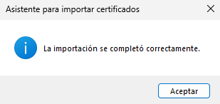

S’ha fet correctament la importació

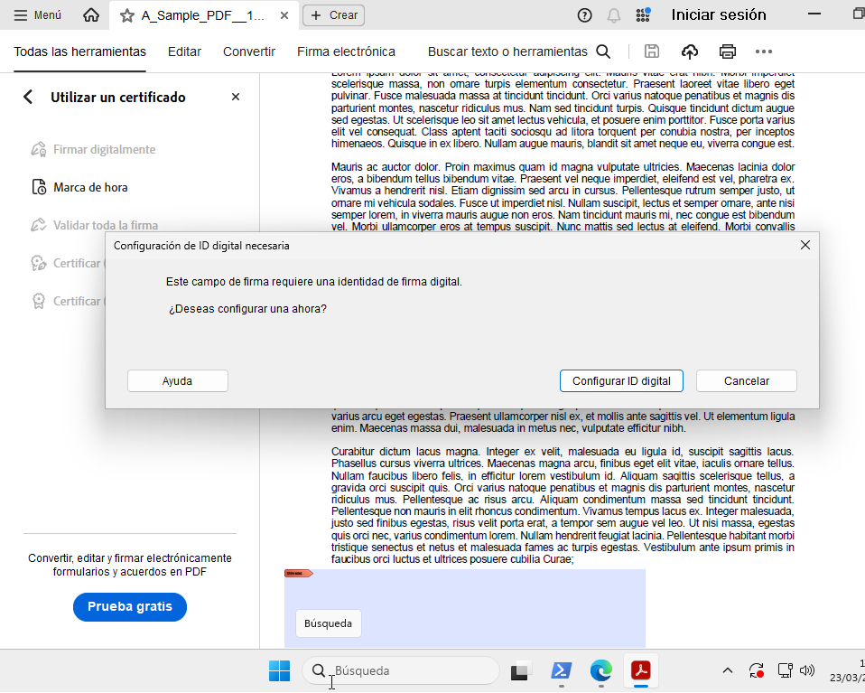

Busquem en al navegador una mostra de pdf la obrim a l’acrobat i seleccionem el lloc del pdf on volem que estigui la nostra firma. 

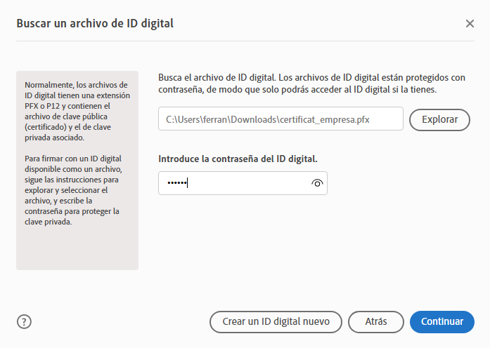

Agafem al arxiu de pfx posem la contrasenya que hem posat a la hora de importar al certificat. 

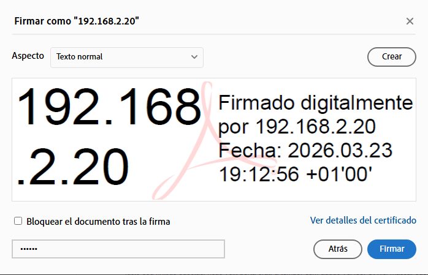

I ens surt aquesta firma per defecte que es la ip del servidor. 

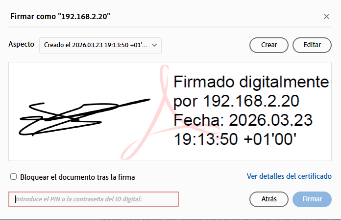

Li donem a crear fem la firma posem la contrasenya de abans i li donem a firmar. 

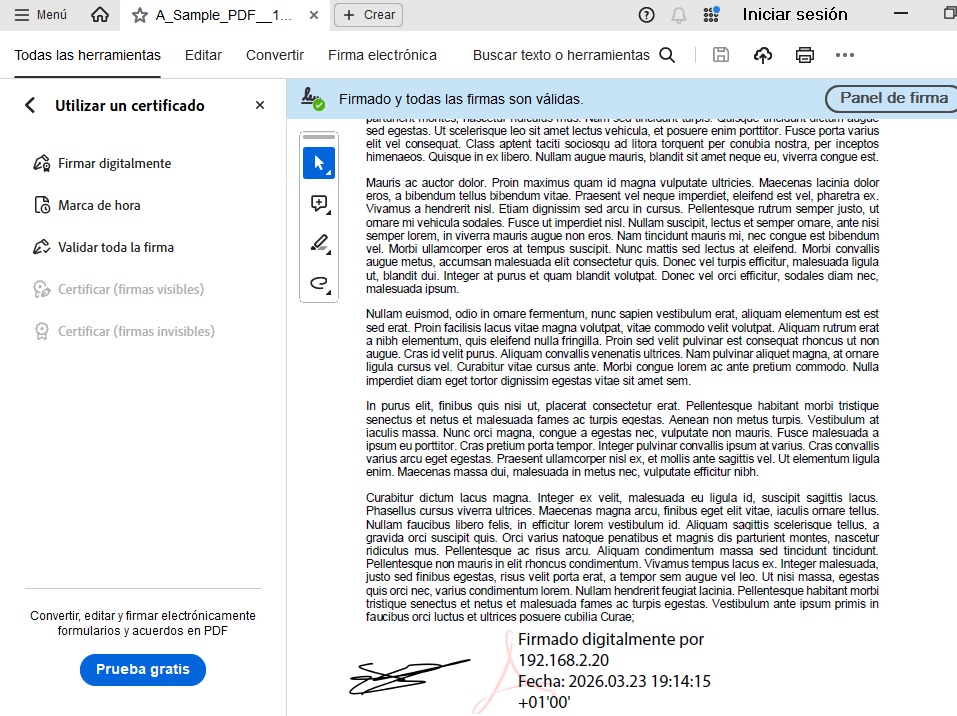

I ja tindrem firmat al pdf amb la nostre firma.