# Guia tècnica del servidor: Implementació de la PKI corporativa (Administrador)
Aquesta guia descriu el treball realitzat per l’administrador per posar en marxa l’Autoritat de Certificació (CA) corporativa sobre un Ubuntu Server, publicar els certificats i fer-los accessibles als clients.

### Configuració inicial de xarxa:

Em de posar el primer adaptador en xarxa NAT i el segon en adaptador pont per tal de poder fer la conexió correcta amb al client. Tal i com veiem a la imatge es veu pefectament. :)

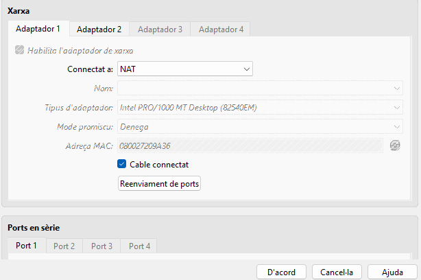
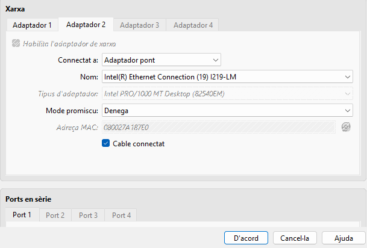

Aqui com podem veure configuro al netplan per personalitzar la ip i també cambio al domini com es pot veure a la imatge ja que la activitat ho requereix.

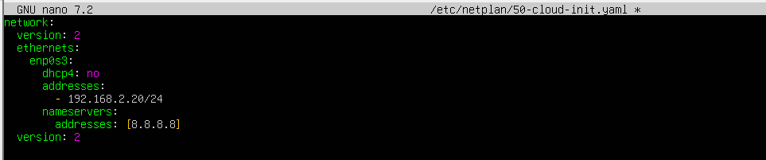
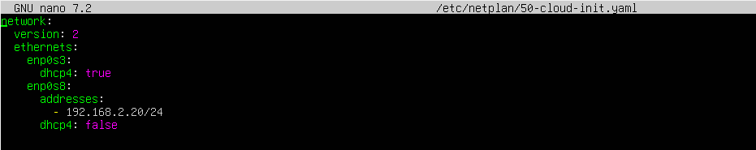
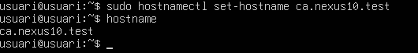

### Preparació de l’entorn de l’Autoritat de Certificació i configuració  OPENSSL:

Es va crear l’estructura de directoris que OpenSSL utilitzarà per emmagatzemar la base de dades de certificats, els certificats emesos, les llistes de revocació i la clau privada.

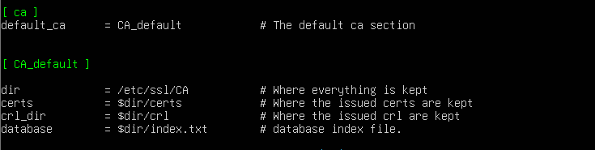
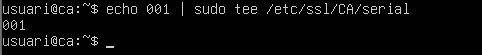
### Generació del certificat arrel (CA)

Un cop hem fet l´estructura de directoris i la configuració open ssl he m de generar els certficats nesecaris:

* Certificat de l’Autoritat de Certificació (CA): es va crear un certificat autosignat que actua com a arrel de confiança. Per fer-ho, es va executar l’ordre que genera una clau privada i un certificat autosignat, indicant la ruta on emmagatzemar-los i la validesa (10 anys). Durant el procés es va protegir la clau privada amb una contrasenya i es van introduir les dades de l’organització (Nexus, ubicació, nom del servidor). Aquest certificat és el que després es distribueix als clients perquè confiïn en tots els certificats emesos per la nostra CA.

* Certificat d’usuari: el client va generar una sol·licitud (CSR) amb les seves dades i la va enviar a l’administrador. Amb l’ordre de signatura d’OpenSSL, l’administrador va processar aquesta sol·licitud: va verificar la informació, va demanar la contrasenya de la CA per desbloquejar la clau privada i va emetre el certificat digital signat. Aquest certificat conté la clau pública de l’usuari i està vinculat a la identitat que va indicar a la sol·licitud. La signatura de la CA garanteix que el certificat és autèntic i pot ser utilitzat per a la signatura de documents.

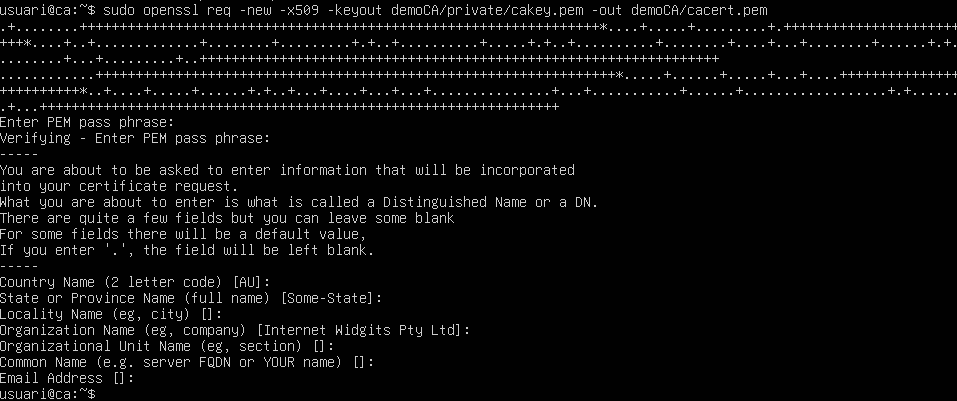

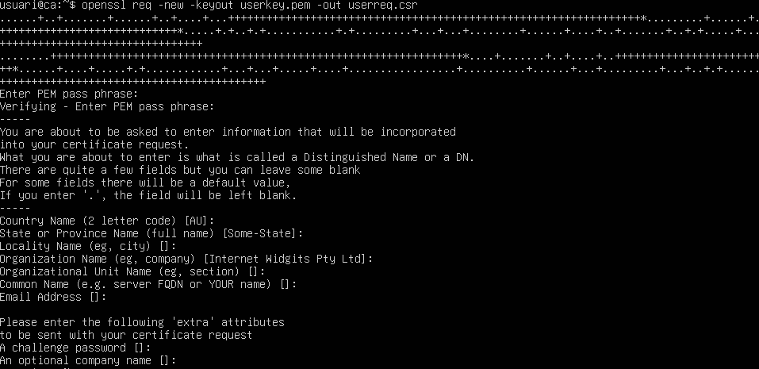

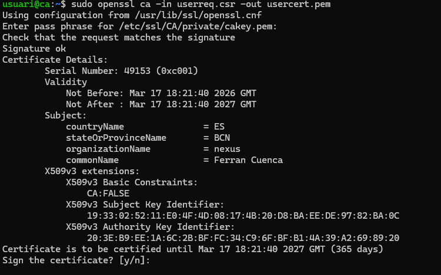

### Permisos

Ara hem de posar els permisos correctes, perque el client pugui entrar sense cap problema.

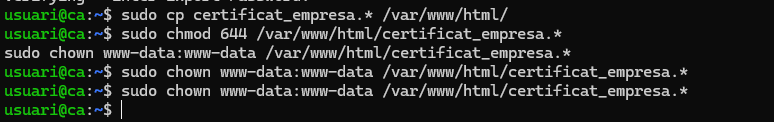

### Publicació dels certificats a través d’un portal web

Hem d´instalar o apache o nginx per fer un portal web que serà on al client entrara atraves de la ip del servidor per poguer descarregar els certficats que hem creat anteriorment.
Com podeu veure a la imatge:

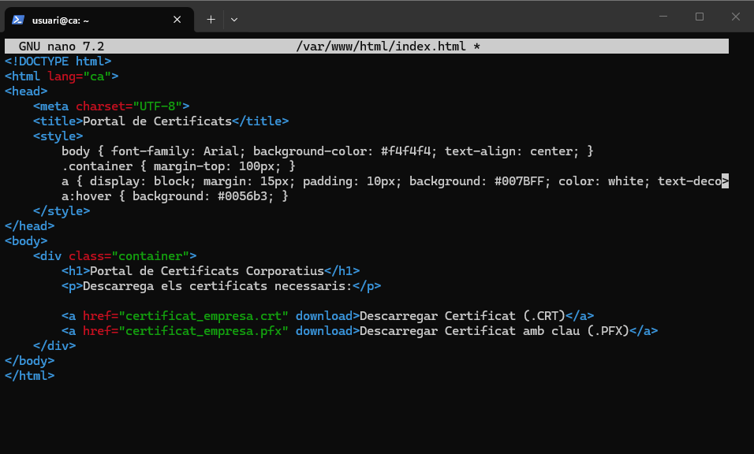