# Guia d’implementació – TransLògic S.A.

## Introducció
Aquesta guia descriu els passos necessaris per completar l’activitat de configuració de l’entorn de TransLògic S.A., basant-se en les captures d’imatge realitzades durant el procés. Per a cada apartat s’indiquen les accions a realitzar i, just a sota de l’explicació, el nom de la imatge que s’ha d’adjuntar com a evidència.

---

## 1. Polítiques de Seguretat i Contrasenyes

### 1.1 Política global (Default Domain Policy)
**Acció:** Modificar la política per defecte del domini per establir una longitud mínima de contrasenya de 8 caràcters.

**On es fa:** Group Policy Management → Default Domain Policy → Edit → Computer Configuration → Policies → Windows Settings → Security Settings → Account Policies → Password Policy → “Minimum password length”.

Tal com es veu a la imatge:

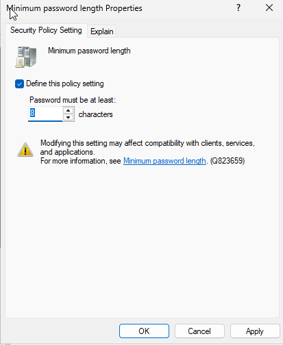

### 1.2 Política específica per a Gerència (VIP)
**Acció:** Crear una GPO anomenada POL_Contrasenyes_Gerencia i configurar els paràmetres següents:

* **Longitud mínima:** 18 caràcters
* **Caducitat:** 28 dies
* **Complexitat:** Deshabilitada
* Activar l’opció “Relax minimum password length limits”

**Passos detallats:**

1. Crear la GPO des de l’OU gerencia → New GPO → nom POL_Contrasenyes_Gerencia.

Tal com es veu a la imatge:

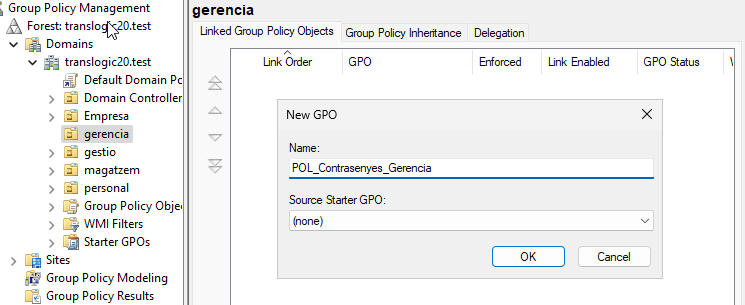

2. Editar la GPO i accedir a la configuració de la política de contrasenyes.

Tal com es veu a la imatge:

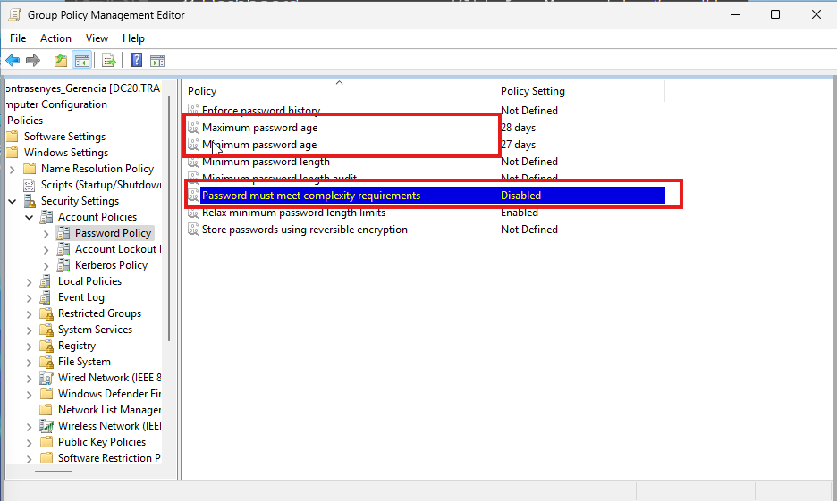

3. Activar l’opció “Relax minimum password length limits” (Enabled).

Tal com es veu a la imatge:

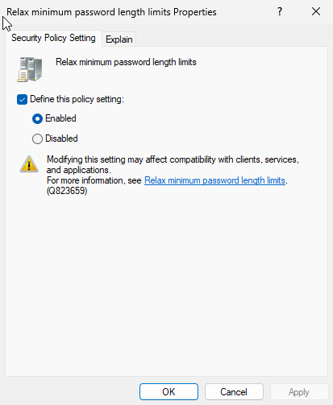

4. Definir “Minimum password length = 18”.

Tal com es veu a la imatge:

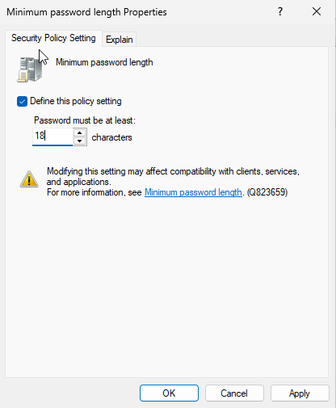

5. Definir “Maximum password age = 28 dies”.

Tal com es veu a la imatge:

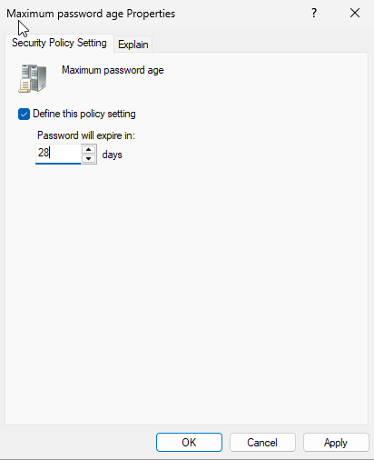

6. Deshabilitar “Password must meet complexity requirements” (Disabled).

Tal com es veu a la imatge:

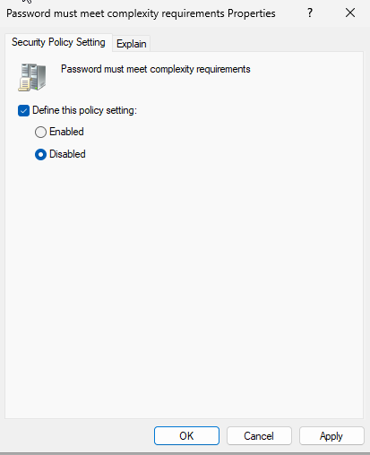

7. Comprovar que l’enllaç a l’OU gerencia està habilitat: a l’OU gerencia, pestanya “Linked Group Policy Objects”, la GPO ha de tenir Link Enabled = Yes.

Tal com es veu a la imatge:

### 1.3 GPO Bonus – Bloqueig de pantalla per a Magatzem
**Acció:** Crear una GPO POL_Bloqueig_Pantalla_Magatzem per a l’OU magatzem que activi el protector de pantalla amb contrasenya després de 5 minuts d’inactivitat.

**Justificació:** En un entorn de magatzem, els equips queden sovint desatesos; aquesta mesura evita accessos no autoritzats.

**Passos detallats:**

1. Crear la GPO des de l’OU magatzem.

Tal com es veu a la imatge:

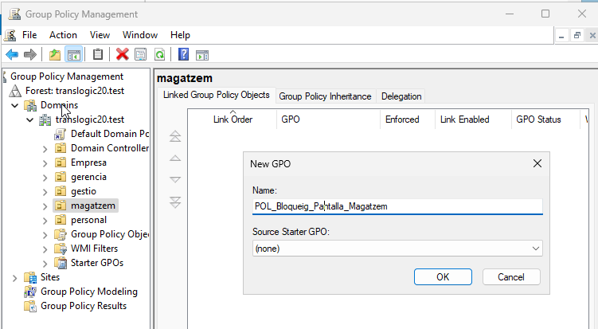

2. Configurar “Enable screen saver” = Enabled.

Tal com es veu a la imatge:

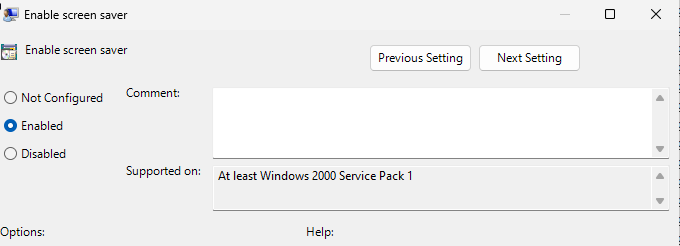

3. Configurar “Screen saver timeout” = Enabled, segons = 300.

Tal com es veu a la imatge:

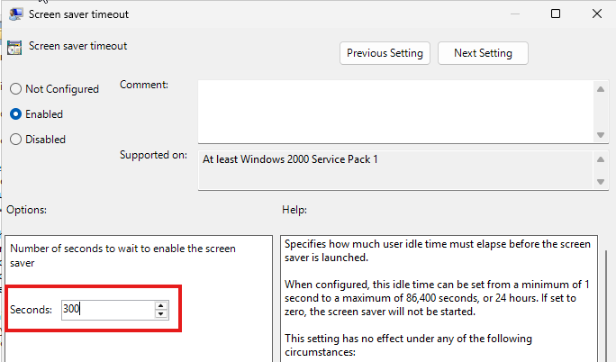

4. Configurar “Password protect the screen saver” = Enabled.

Tal com es veu a la imatge:

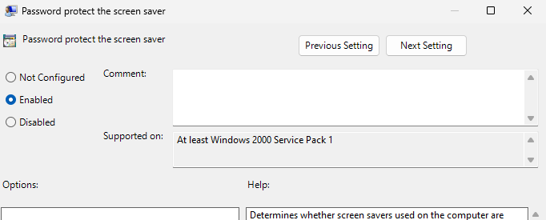

5. Vista general de les polítiques aplicades.

Tal com es veu a la imatge:

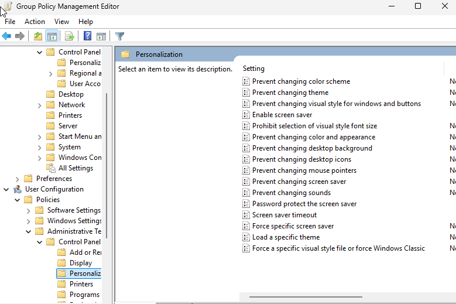

---

## 2. Desplegament Automatitzat de Programari

### 2.1 Preparació de la carpeta compartida i fitxers MSI
**Acció:** Assegurar que els fitxers 7z2600-x64.msi i Firefox Setup 148.0.msi es troben en una carpeta compartida accessible des dels equips clients.

**Passos detallats:**

1. Localitzar els fitxers a C:\Programari\MSI.

Tal com es veu a la imatge:

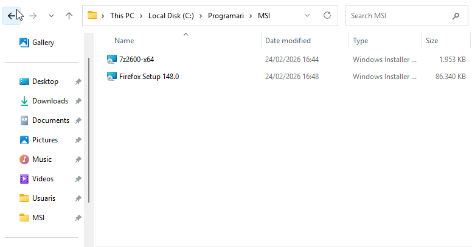

2. Seleccionar els usuaris o grups per compartir la carpeta.

Tal com es veu a la imatge:

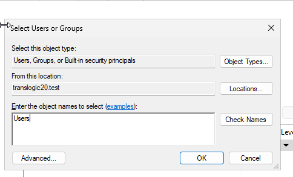

3. Assignar permisos de lectura als usuaris del domini.

Tal com es veu a la imatge:

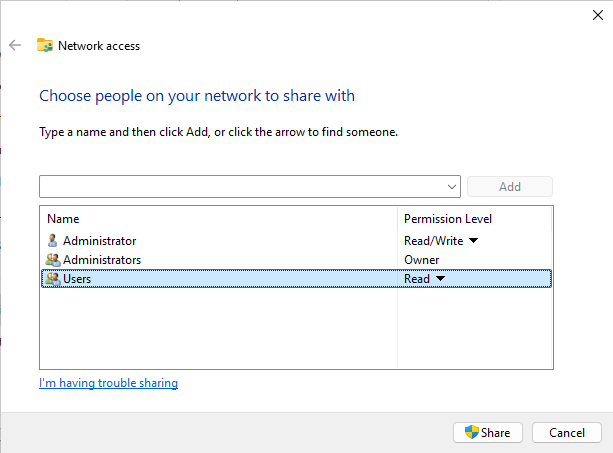

4. Confirmar la ruta compartida \\DC20\Programari.

Tal com es veu a la imatge:

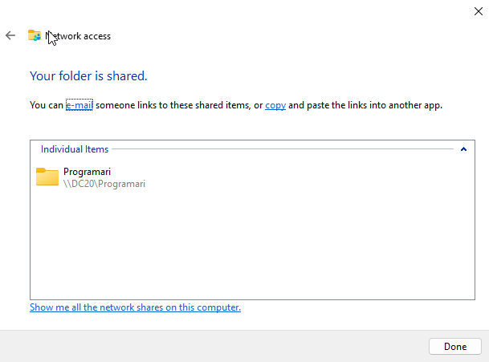

### 2.2 GPO per a Gestió (7-Zip assignat)
**Acció:** Crear una GPO POL_Software_Gestio enllaçada a l’OU gestio que desplegui 7-Zip en mode Assigned (instal·lació automàtica).

**Passos detallats:**

1. Crear la GPO i editar-la.
2. Anar a Computer Configuration → Policies → Software Settings → Software installation.
3. Nou paquet → seleccionar \\DC20\Programari\7z2600-x64.msi → triar Assigned.

Tal com es veu a la imatge:

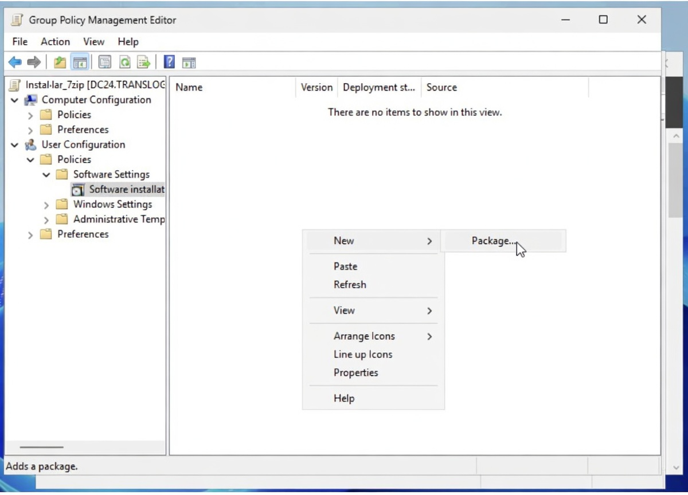
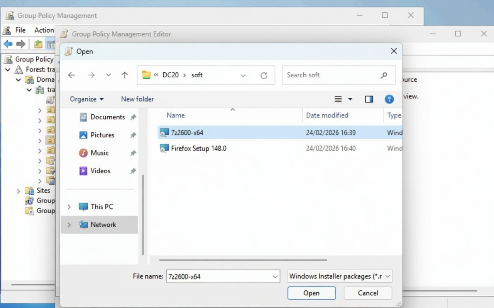
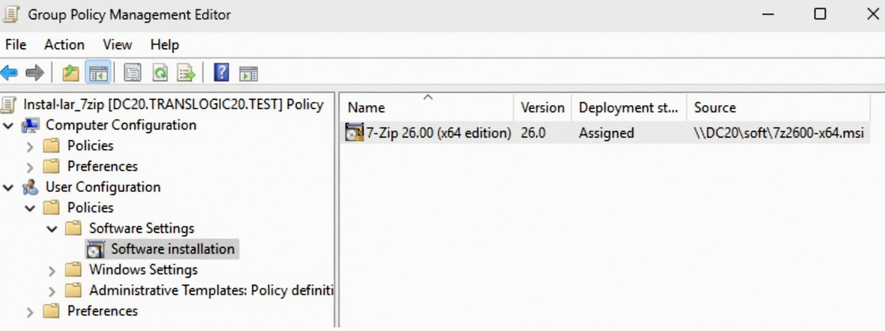
---
### 2.3 Desplagament firefox:

S'ha actualitzat la configuració del Firefox a través de Group Policy per al domini translogic20.test.
Ara l'aplicació es desplega des del servidor DC20.TRANSLOGIC20.TEST amb la versió 148.0 publicada correctament.

## 3. Mobilitat d’Usuaris (Perfils Mòbils)

### 3.1 Creació de la carpeta compartida perfils
**Acció:** Crear una carpeta al servidor (ex. C:\perfils) i compartir-la amb permisos adequats.

**Passos detallats:**

1. Crear la carpeta.
2. Compartir-la amb nom perfils i permisos de compartir: Usuaris del domini amb Canvi.
3. Configurar permisos NTFS: Usuaris del domini amb Modificació.

Tal com es veu a les imatges:

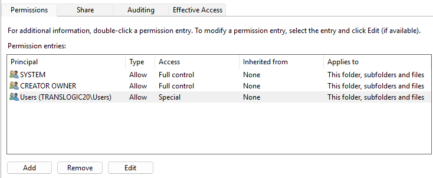
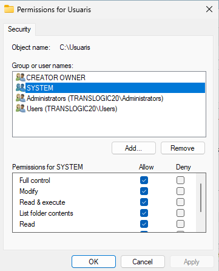
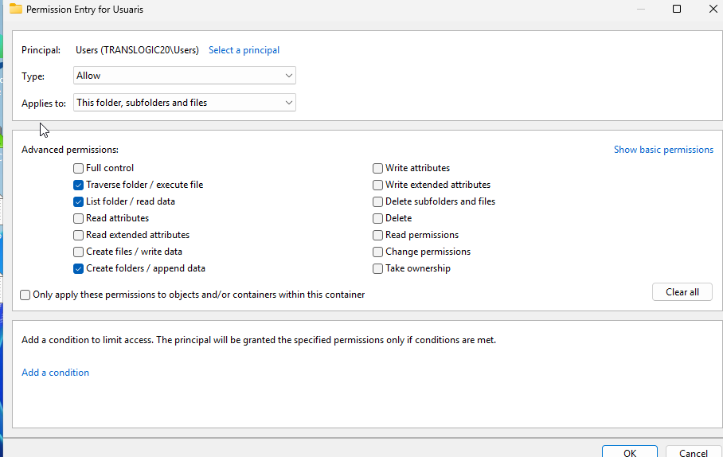

---

## 4. Seguretat de Dades (Redirecció de Carpetes)

### 4.1 Configuració de la redirecció de Documents
**Acció:** Crear o modificar una GPO enllaçada a l’arrel del domini per redirigir la carpeta “Documents” a la carpeta personal de l’usuari (home folder).

Tal com es veu a la imatge:

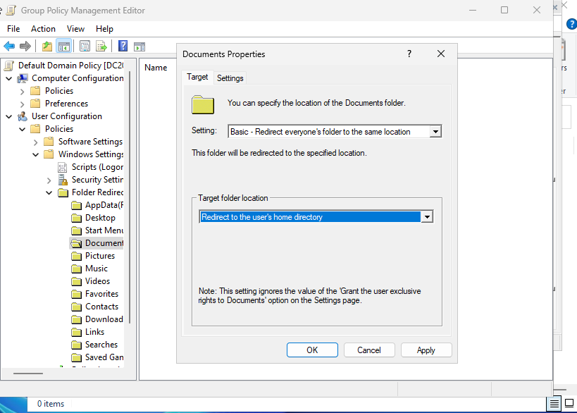

---

## 5. Delegació de Funcions (Helpdesk)

### 5.1 Creació de l’usuari adminOU
**Acció:** Crear un usuari dins l’OU Users amb nom adminOU i contrasenya que no caduqui.

Tal com es veu a la imatge:

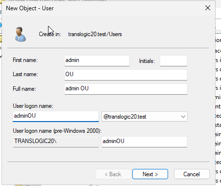

Configurar la contrasenya marcant “Password never expires”.

Tal com es veu a la imatge:

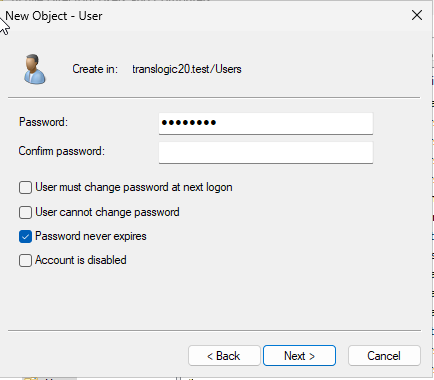

### 5.2 Delegació de control sobre l’OU principal
**Acció:** Atorgar a l’usuari adminOU permisos per reiniciar contrasenyes i modificar la pertinença a grups.

Tal com es veu a la imatge:

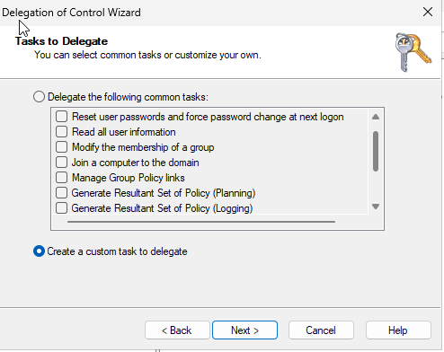

Tal com es veu a la imatge:

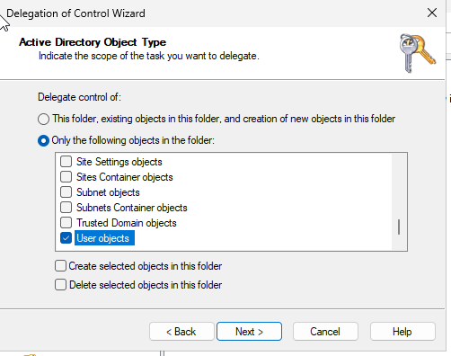

Tal com es veu a la imatge:

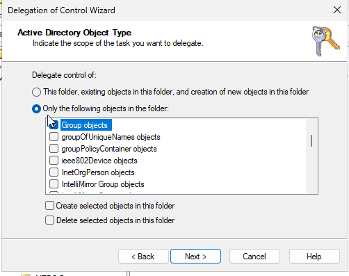

Ara instalarem al rs. Tal i com es veu a la imatge:

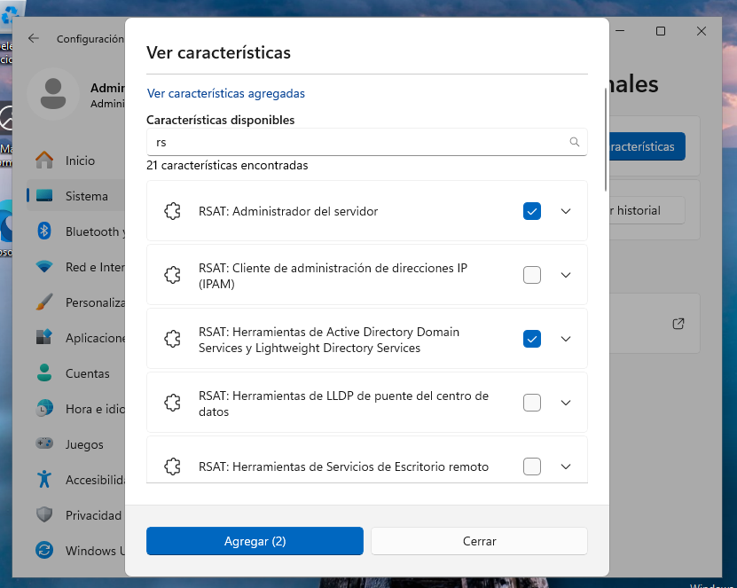
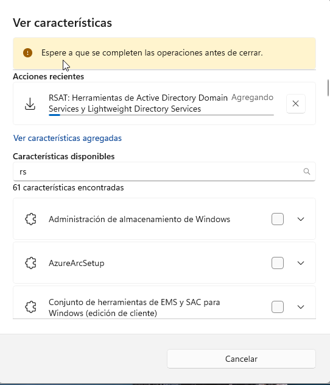

## Conclusió:
Aquest conjunt de configuracions transforma la infraestructura de TransLògic S.A. en un sistema escalable. Les evidències gràfiques adjuntades al llarg del document certifiquen que cada directiva (GPO) i configuració de xarxa s'han aplicat seguint les millors pràctiques d'administració de sistemes Windows Server.
