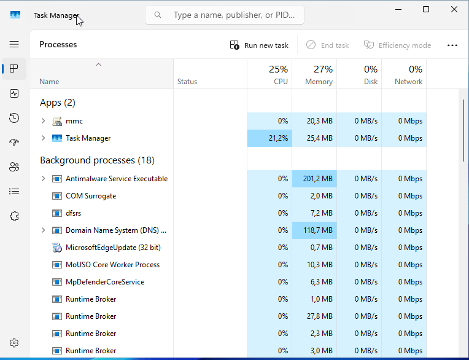
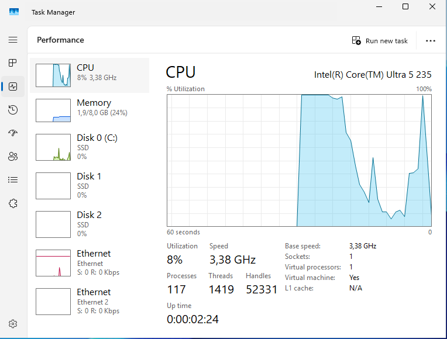
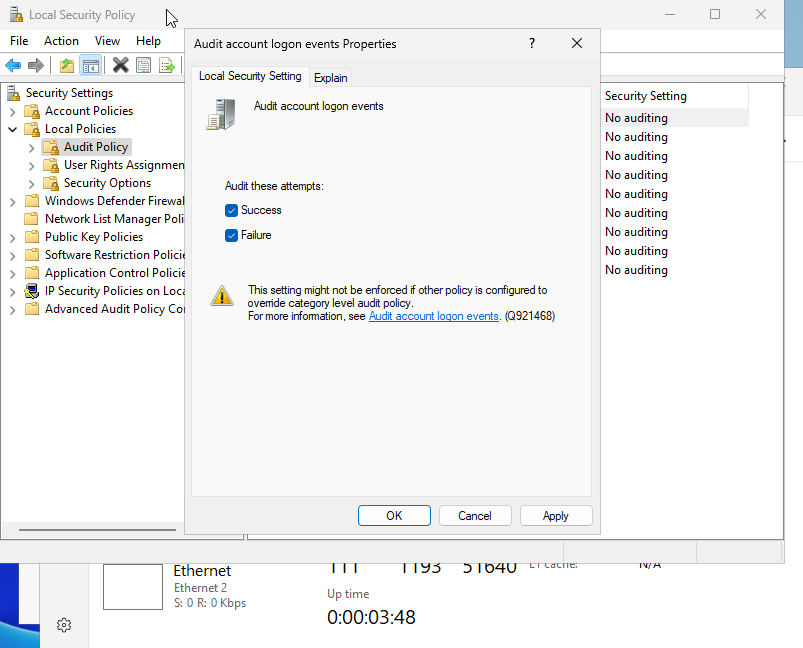
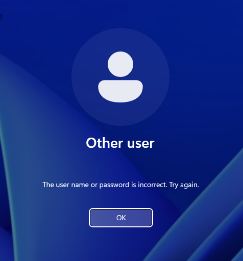
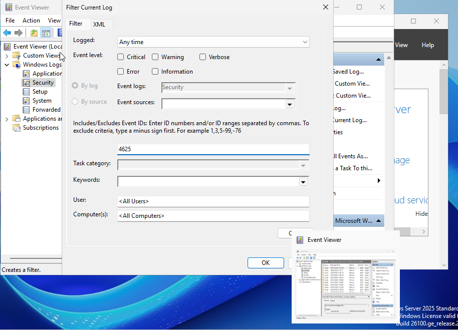
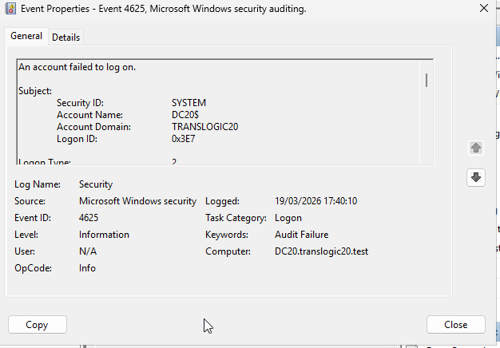
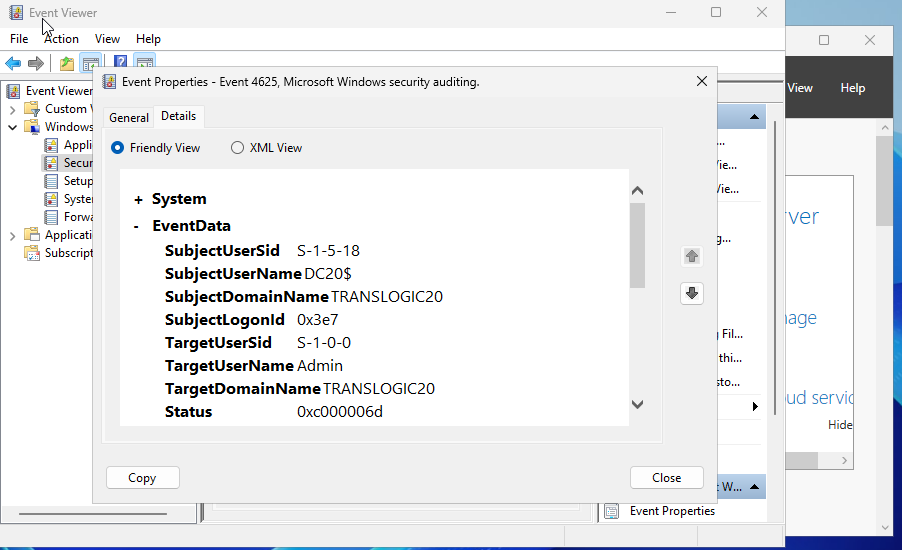

## T08: Vigilància i auditoria de sistemes

INTRODUCCIÓ (Què farem i per què)

MONITORITZACIÓ DE RECURSOS:

1. Obrir el Gestor de tasques
Prem Ctrl + Maj + Esc alhora.
Si només veus una finestra petita, fes clic a "Més detalls" (a baix a l'esquerra).
2. Anar a la pestanya "Rendiment"
Aquí veuràs gràfics en temps real de:
CPU: Percentatge d'ús del processador.
Memòria: Quantitat de RAM utilitzada i lliure.
3. Fer la captura
Fes una foto de la pantalla (tecla Impr Pant o Alt + Impr Pant).

Què signifiquen les dades? 

Indicador |  Valor bo   |      Valor preocupant

CPU  |    Menys del 50% d'ús  |  Més del 80% sostingut

Memòria  |  Més del 20% lliure  |  Menys del 10% lliure

## 2. CONFIGURACIÓ D'AUDITORIA DE SEGURETAT

1. Obrir la Política de seguretat local
Prem Win + R (tecla de Windows + R).
Escriu secpol.msc i prem Enter.
Això obre l'eina per configurar les normes de seguretat del servidor.

2. Navegar fins a la política correcta
Al panell esquerre, desplega "Polítiques locals".
Fes clic a "Política d'auditoria".

3. Configurar l'auditoria d'inicis de sessió
Busca a la llista: "Auditar successos d'inici de sessió".
Fes doble clic sobre aquesta línia.

4. Activar èxits i errors
A la finestra que s'obre, marca:
Correcte → Per saber quan algú entra correctament.
Error → Per saber quan algú intenta entrar i falla.
Els errors són molt importants per detectar atacs de força bruta.

5. Aplicar els canvis
Fes clic a D'acord.

## 3. SIMULACIÓ D'INCIDENTS (HACKING ÈTIC)

1. Tancar la sessió actual
Fes clic a Inici → icona del teu usuari → "Tanca la sessió".
Això et porta a la pantalla d'inici de sessió.

2. Simular intents fallits (atac de força bruta)
Escriu un nom d'usuari que existeixi (ex: Administrador o un altre).
Introdueix una contrasenya incorrecta expressament.
Repeteix 3 o 4 vegades.
Cada intent fallit generarà un registre d'error.

3. Iniciar sessió correctament
Finalment, entra amb un usuari i contrasenya correctes.
Això generarà un registre d'èxit.

## 4. ANÀLISI FORENSE 

1. Obrir el Visor d'esdeveniments
Prem Win + R.
Escriu eventvwr.msc i prem Enter.
S'obrirà l'eina on es guarden tots els registres del sistema.

2. Anar als registres de seguretat
Al panell esquerre, desplega "Registres de Windows".
Fes clic a "Seguretat".
Aquí es guarden tots els esdeveniments relacionats amb accessos i permisos.

3. Buscar els intents fallits
A la columna central, busca esdeveniments amb:
Nivell: "Error" o "Audició fallida"
Data i hora: Les dels teus intents
Identifica l'ID 4625 (a la columna "ID de l'esdeveniment").

4. Examinar els detalls d'un intent fallit
Fes doble clic sobre un esdeveniment 4625.
S'obrirà una finestra amb tota la informació:
Usuari que ho va intentar (ex: "magatzem")
Hora exacta
Origen: Si és local, posa "-"; si és remot, IP
Tipus d'inici de sessió: 2 per interactiu (teclat), 3 per xarxa, etc.

Per què és important l'ID 4625?
És la "prova del delicte". Si veus molts 4625 seguits del mateix usuari, probablement algú està intentant endevinar la contrasenya.

## 5. RESPOSTA TÈCNICA

Pregunta: Quin és l'Event ID per errors d'inici de sessió?
Resposta completa per a l'informe:
A Windows Server, l'identificador d'esdeveniment (Event ID) que correspon a un intent d'inici de sessió fallit és el 4625. Aquest esdeveniment registra informació crítica com l'usuari que ho ha intentat, l'hora, l'estació de treball des d'on s'ha intentat i el tipus d'inici de sessió.
